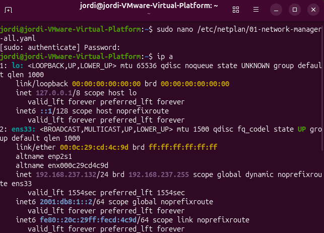

# 🔗 Koneksi IPv6 antar 2 VM Ubuntu (VMware Workstation)


Dokumentasi praktik menghubungkan dua Virtual Machine Ubuntu di VMware Workstation menggunakan alamat **IPv6**, lalu menguji konektivitasnya dengan `ping`.

## 📑 Daftar Isi

- [Anggota Kelompok](#anggota-kelompok)
- [Deskripsi Tugas](#deskripsi-tugas)
- [Alat dan Bahan](#alat-dan-bahan)
- [Topologi Jaringan](#topologi-jaringan)
- [Struktur Folder](#struktur-folder)
- [Langkah Kerja](#langkah-kerja)
- [Hasil Pengujian](#hasil-pengujian)
- [Troubleshooting](#troubleshooting)
- [Kesimpulan](#kesimpulan)

## 👥 Anggota Kelompok

**Kelompok:** _(isi nama kelompok di sini)_

| No | Nama | NIM / Kelas |
|----|------|-------------|
| 1  | 5024241070 | Valian Tsaqif Hidayat | 
| 2  | 5024241029 | Jordi |
| 3  | 5024241088 | Najib Fathir Rizqi |
| 4  | 5024241083 | Muhammad Arifin Umasangadji |

## 📌 Deskripsi Tugas

Tugas ini membahas cara menghubungkan dua Virtual Machine (VM) Ubuntu menggunakan **VMware Workstation**, lalu menguji konektivitasnya dengan alamat **IPv6** melalui perintah `ping`. Kedua VM ditempatkan pada satu jaringan virtual yang sama, diberi alamat IPv6 statis dalam satu subnet, kemudian diuji saling terhubung dua arah.

## 🛠️ Alat dan Bahan

- VMware Workstation
- 2 VM Ubuntu (VM1 dan VM2)
- Mode jaringan virtual: **Host-only** atau **LAN Segment**
- Alamat IPv6 dokumentasi: `2001:db8:1::/64`

## 🖧 Topologi Jaringan

```
   VM1                         VM2
2001:db8:1::1/64   <---->   2001:db8:1::2/64
        |                        |
        +------ Virtual Switch ------+
             (Host-only / LAN Segment)
```

## 📁 Struktur Folder

```
.
├── README.md
├── images/
│   ├── konfigurasi-ipv6-vm1.png
│   ├── konfigurasi-ipv6-vm2.png
│   ├── ping-vm1-ke-vm2.png
│   └── ping-vm2-ke-vm1.png
└── netplan/
    ├── vm1-config.yaml
    └── vm2-config.yaml
```

> Folder `netplan/` bersifat opsional — isi dengan file konfigurasi netplan yang dipakai di VM1 dan VM2 kalau ingin disertakan sebagai bukti tambahan.

## 🚀 Langkah Kerja

### a. Setup Network Adapter di VMware
- Matikan kedua VM, buka **Settings > Network Adapter**.
- Pilih mode **Host-only**.
- Pastikan **kedua VM memakai mode dan nama segment yang sama**.

### b. Clone VM (opsional, jika VM2 dibuat dari VM1)
- Clone dilakukan lewat **Manage > Clone** saat VM sumber dalam keadaan mati.
- Setelah clone, ubah agar tidak bentrok dengan VM asal:
  - Alamat IPv6
  - Hostname
  - Machine-id

### c. Konfigurasi Alamat IPv6

| VM | Alamat IPv6 |
|----|-------------|
| VM1 | `2001:db8:1::1/64` |
| VM2 | `2001:db8:1::2/64` |

edit file di `/etc/netplan/`, lalu jalankan `sudo netplan apply`.

### d. Pengujian Koneksi

```bash
ping -6 -c 4 2001:db8:1::2   # dari VM1 ke VM2
ping -6 -c 4 2001:db8:1::1   # dari VM2 ke VM1
```

Koneksi berhasil jika muncul balasan (*reply*) dari kedua arah tanpa *packet loss*.

## 📊 Hasil Pengujian

> Tempatkan screenshot hasil pada folder `images/` (lihat [Struktur Folder](#struktur-folder)), lalu pastikan nama filenya sesuai dengan yang dirujuk di bawah ini.

**Konfigurasi IPv6 di VM1**


**Konfigurasi IPv6 di VM2**



**Hasil Ping dari VM1 ke VM2**


**Hasil Ping dari VM2 ke VM1**


## 🐞 Troubleshooting

| Masalah | Penyebab Umum | Solusi |
|---|---|---|
| `Cannot find unique matching interface` | Nama interface di file netplan tidak cocok, atau ada 2 file netplan bentrok | Cek `ip a`, samakan nama interface, gabungkan/hapus file netplan yang bentrok |
| `systemd-networkd is not running` | Ubuntu Desktop pakai NetworkManager, tapi `renderer` di netplan diset `networkd` | Ubah `renderer: NetworkManager` |
| `Name or service not known` saat ping | Perintah ping ikut menyertakan `/64` | Hilangkan prefix, ping cukup alamatnya saja |
| Ping gagal total | Mode Network Adapter beda antar VM, firewall aktif, atau IPv6 dinonaktifkan | Samakan mode adapter, cek `ufw status`, cek `sysctl net.ipv6.conf.all.disable_ipv6` |

## ✅ Kesimpulan

_(isi kesimpulan kelompok di sini — misalnya: apakah ping berhasil, kendala yang ditemui, dan pelajaran yang didapat dari praktik ini)_
